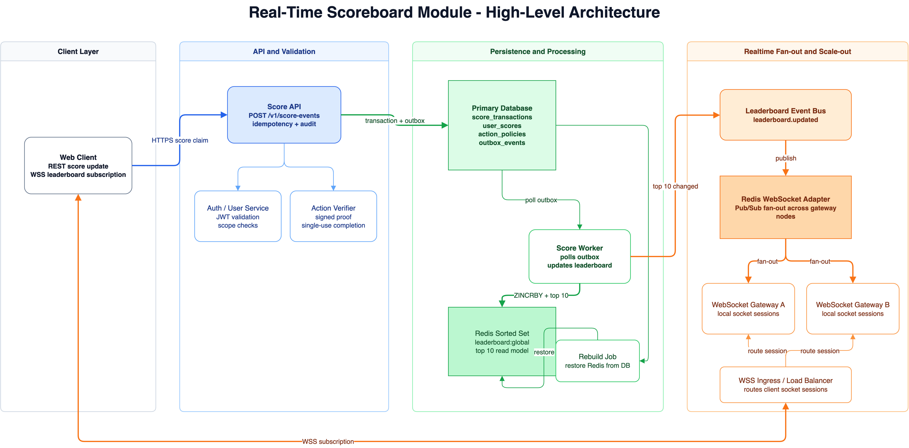
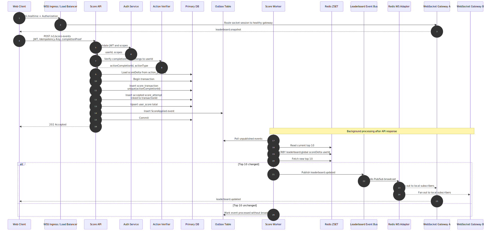
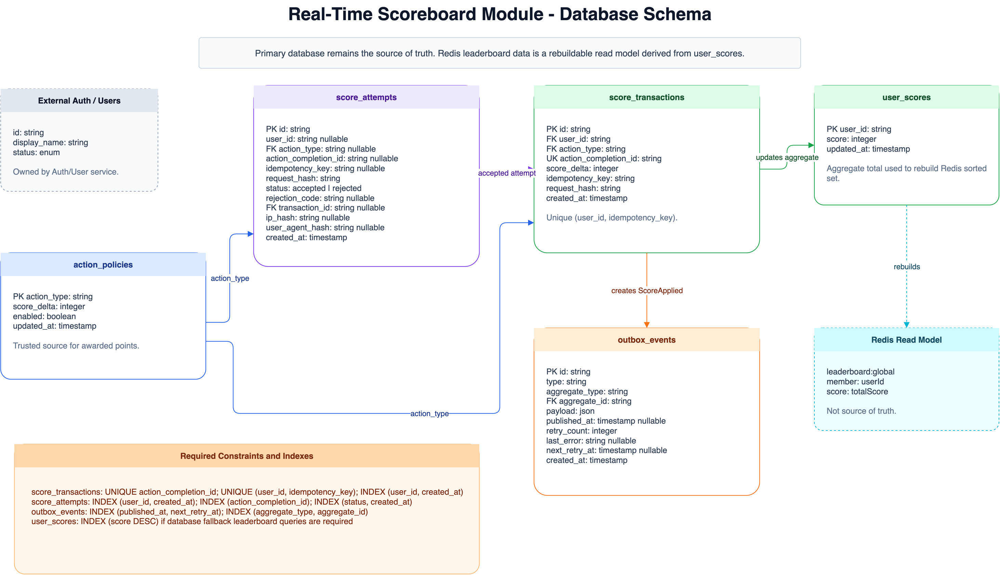

# Problem 6: Real-Time Scoreboard Module Specification

## 1. Purpose

This document specifies a backend API module for maintaining and broadcasting a
real-time scoreboard that shows the top 10 user scores.

The target audience is the backend engineering team that will implement the
module.

## 2. Requirements Covered

- Show the top 10 users by score on a website.
- Push live scoreboard updates to connected clients.
- Increase a user's score after the user completes an action.
- Receive an API call when an action is completed.
- Prevent malicious users from increasing scores without authorization.

## 3. Requirement Traceability

| Assignment requirement | Specification coverage |
| --- | --- |
| Website shows the top 10 user scores | `GET /v1/leaderboard`, Redis sorted set read model, and leaderboard update logic define the ordered top 10 response. |
| Live update of the scoreboard | WebSocket specification, `LeaderboardUpdated` event schema, event bus, and Redis WebSocket adapter cover realtime delivery across multiple gateway instances. |
| User action completion increases score | `POST /v1/score-events`, `score_transactions`, `user_scores`, and score worker flow define how one valid completion changes the user's total score. |
| Action completion dispatches an API call | The score event submission endpoint is the public contract called after action completion. |
| Prevent unauthorized score increases | Key security decision, completion proof validation, trusted action policies, idempotency, replay protection, rate limiting, and audit records cover fraud prevention. |
| Backend team can implement from the spec | API contracts, data model, events, reliability rules, observability, and implementation phases describe the expected build plan. |

## 4. Scope

This module owns:

- Score increment API.
- Score transaction ledger.
- Aggregated user scores.
- Top 10 leaderboard read model.
- Real-time leaderboard broadcast events.
- Authorization, replay protection, and audit records for score changes.

This module does not own:

- The business rules of the user action itself.
- User registration and password authentication.
- Frontend rendering.

Assumptions:

- Scores are integer points. If the product later needs fractional points, store
  scores in minor units, for example milli-points, or change the schema before
  launch.

## 5. Key Security Decision

The client must never be trusted to submit the score delta directly.

The score service must only accept an action completion proof generated or
verifiable by a trusted server-side system. The proof can be one of these:

- A short-lived signed completion token issued by the action service.
- A server-verifiable action completion ID.
- A callback from a trusted internal service instead of the browser.

The client request can identify the completed action, but the backend must derive
the score delta from trusted server-side configuration or a signed claim.

## 6. High-Level Architecture



## 7. Components

| Component | Responsibility |
| --- | --- |
| Web Client | Calls the score API after action completion and subscribes to live leaderboard updates. |
| Score API | Authenticates the user, validates completion proof, records the score transaction, and writes an outbox event. |
| Auth/User Service | Validates JWT and user identity. |
| Action Verification | Verifies that the submitted action completion is genuine and belongs to the authenticated user. |
| Primary Database | Source of truth for transactions, idempotency keys, action claims, and aggregate scores. |
| Transactional Outbox | Guarantees score events are published after the database transaction commits. |
| Score Worker | Applies score changes to Redis, compares top 10 changes, and publishes `LeaderboardUpdated` to the event bus. |
| Redis | Stores the hot leaderboard using a sorted set. |
| Leaderboard Event Bus | Carries `leaderboard.updated` events from the worker to the realtime delivery layer. |
| WSS Ingress / Load Balancer | Routes WebSocket upgrade requests to healthy gateway instances so socket capacity can scale horizontally. |
| WebSocket Gateway | Sends initial snapshots and live leaderboard updates to subscribed clients. |
| Redis WebSocket Adapter | Connects multiple WebSocket gateway instances through Redis Pub/Sub so leaderboard broadcasts reach clients connected to any gateway instance. |

## 8. Non-Functional Requirements and Capacity Targets

These targets are initial production goals. The implementation team should
validate and tune them with load testing before launch.

| Area | Target |
| --- | --- |
| Leaderboard read latency | `p95 <= 100 ms` from Redis under normal load; database fallback should target `p95 <= 500 ms`. |
| Score submission latency | `p95 <= 200 ms` for API processing after completion proof validation; return `202 Accepted` after the database transaction and outbox write commit. |
| Realtime propagation | `p95 <= 1 second` from committed score transaction to client-visible leaderboard update; target `<= 250 ms` during normal traffic. |
| Write throughput | Baseline target of `100 score events/second`, with burst handling to `500 score events/second` by scaling API instances and workers. |
| WebSocket capacity | Support horizontal scaling through WSS ingress and Redis WebSocket adapter; use load testing to set the per-gateway limit, with an initial target of `5,000-10,000` active sockets per gateway instance. |
| Availability | Score write API and leaderboard read API should target `99.9%` monthly availability for the first production release. |
| Durability | Once `POST /v1/score-events` returns success, no accepted score transaction may be lost; the database is the source of truth. |
| Consistency | Database score state is strongly consistent per accepted transaction; Redis leaderboard and WebSocket clients are eventually consistent within the realtime propagation target. |
| Security | Invalid, expired, replayed, or mismatched completion proofs must not change score and must create an audit record. |
| Audit retention | Keep score transactions permanently unless product policy says otherwise; keep rejected attempts for at least `90 days` or the agreed abuse-investigation window. |

## 9. Execution Flow



## 10. API Specification

### 10.1 Submit Score Event

```http
POST /v1/score-events
Authorization: Bearer <access_token>
Idempotency-Key: <uuid>
Content-Type: application/json
```

Request body:

```json
{
  "actionType": "daily_quiz_completed",
  "actionCompletionId": "act_01HRK7QK4G6M6R7P4JX0Z8",
  "completionProof": "signed-token-or-server-verifiable-proof"
}
```

Rules:

- `Authorization` is required.
- `Idempotency-Key` is required and must be unique per authenticated user and request intent.
- `actionCompletionId` must be globally unique.
- The backend must verify the completion proof before awarding points.
- The backend must derive `scoreDelta` from `action_policies`; the client must
  not submit it.
- The backend must record every accepted or rejected submission attempt in
  `score_attempts` for audit and abuse investigation.
- If the same idempotency key and same request body are retried, return the
  original successful response body. If the same idempotency key is reused with a
  different request body, return `409 IDEMPOTENCY_CONFLICT`.

Success response:

```http
202 Accepted
```

```json
{
  "success": true,
  "status": "accepted",
  "transactionId": "txn_01HRK7R2S5N2",
  "currentScore": 1250
}
```

Error responses:

| Status | Code | Reason |
| --- | --- | --- |
| `400` | `INVALID_REQUEST` | Missing or malformed fields. |
| `401` | `UNAUTHENTICATED` | Missing, expired, or invalid JWT. |
| `403` | `FORBIDDEN` | User is not allowed to claim this action. |
| `403` | `ACTION_DISABLED` | The action type exists but is disabled by policy. |
| `409` | `DUPLICATE_ACTION_COMPLETION` | `actionCompletionId` was already claimed. |
| `409` | `IDEMPOTENCY_CONFLICT` | Same idempotency key reused with a different payload. |
| `422` | `INVALID_COMPLETION_PROOF` | Action proof is invalid or expired. |
| `429` | `RATE_LIMITED` | Too many score update attempts. |

### 10.2 Get Leaderboard Snapshot

```http
GET /v1/leaderboard?limit=10
Authorization: Bearer <access_token>  # optional for public leaderboards
```

Authentication is optional for this read endpoint if the product allows public
scoreboard viewing. Score submission and WebSocket subscription remain
authenticated.

For public leaderboard reads, return `Cache-Control: public, max-age=5,
stale-while-revalidate=30` unless product requirements demand a stricter
freshness guarantee.

Response:

```json
{
  "success": true,
  "data": {
    "version": 42,
    "generatedAt": "2026-06-13T07:00:00.000Z",
    "entries": [
      {
        "rank": 1,
        "userId": "usr_123",
        "displayName": "Alice",
        "score": 3200
      }
    ]
  }
}
```

### 10.3 Issue Action Token (Reference Only)

This endpoint belongs to the trusted action service, not the scoreboard module.
It is shown here only to clarify one possible anti-cheat integration.

```http
POST /v1/actions/token
Authorization: Bearer <access_token>
Content-Type: application/json
```

Request body:

```json
{
  "actionType": "daily_quiz_completed"
}
```

Response:

```json
{
  "actionToken": "signed-action-token",
  "expiresAt": "2026-06-13T07:05:00.000Z"
}
```

Token rules:

- Token must be signed by a trusted backend secret or private key.
- Token must include `userId`, `actionType`, `nonce`, and `expiresAt`.
- The scoreboard module still loads `scoreDelta` from its own trusted
  `action_policies` table or config.
- Token TTL should be short, for example 5 minutes.
- Token expiry validation may allow a small clock-skew leeway, for example 30
  seconds, but expired tokens must never be accepted beyond that leeway.
- Token nonce must be marked as used after the score event is accepted.

## 11. WebSocket Specification

Connection:

```text
wss://api.example.com/realtime
Authorization: Bearer <access_token>
```

Clients connect through the WSS ingress/load balancer. The load balancer
terminates TLS if needed, supports HTTP upgrade, and routes each established
socket to one healthy WebSocket gateway instance. A socket remains attached to
that gateway until disconnect or reconnect, but live leaderboard broadcasts must
not depend on sticky sessions because the Redis WebSocket adapter fans out events
to all gateway instances.

Do not pass long-lived access tokens in query strings because proxies and server
access logs may store URLs. If the platform cannot send headers during the
WebSocket handshake, use a short-lived one-time connection ticket instead.

Client event:

```json
{
  "type": "leaderboard.subscribe",
  "payload": {
    "leaderboard": "global"
  }
}
```

Initial server event:

```json
{
  "type": "leaderboard.snapshot",
  "version": 42,
  "payload": {
    "entries": []
  }
}
```

Live update event:

```json
{
  "type": "leaderboard.updated",
  "version": 43,
  "payload": {
    "entries": [],
    "changedUserIds": ["usr_123"],
    "generatedAt": "2026-06-13T07:01:00.000Z"
  }
}
```

Rules:

- The WSS ingress/load balancer must forward the `Authorization` header or the
  short-lived connection ticket to the selected gateway.
- The gateway validates the JWT or connection ticket during connection.
- Expired tokens must close the connection or require re-authentication.
- Clients receive a fresh snapshot when subscribing or reconnecting.
- Events include a monotonically increasing `version` so clients can ignore stale updates.
- The `entries` array in `leaderboard.updated` is the complete current top 10.
  Clients should replace the displayed leaderboard with this array instead of
  applying a partial diff. `changedUserIds` is only a rendering hint, so users
  removed from the top 10 do not need a separate `removedUserIds` list.
- The gateway should send a heartbeat ping every 25 seconds, require a pong
  within 10 seconds, and close connections after 2 missed heartbeats. The WSS
  ingress idle timeout should be at least 60 seconds, or the heartbeat interval
  must be set below half of the ingress idle timeout.

## 12. Database Schema and Data Model



The primary database is the source of truth for score integrity and auditability.
Redis stores only a rebuildable leaderboard read model.

### `score_attempts`

Stores accepted and rejected score submission attempts for audit and abuse
investigation.

| Column | Type | Notes |
| --- | --- | --- |
| `id` | string | Primary key. |
| `user_id` | string nullable | Authenticated user when available. Nullable for unauthenticated or malformed requests. |
| `action_type` | string nullable | Action category if the request includes one. References `action_policies.action_type` when present. |
| `action_completion_id` | string nullable | Submitted completion ID if present. |
| `idempotency_key` | string nullable | Submitted idempotency key if present. |
| `request_hash` | string | Hash of the normalized request body used for audit and idempotency conflict checks. |
| `status` | enum | `accepted` or `rejected`. |
| `rejection_code` | string nullable | Error code for rejected attempts, for example `INVALID_COMPLETION_PROOF`. |
| `transaction_id` | string nullable | References `score_transactions.id` when the attempt is accepted. |
| `ip_hash` | string nullable | Hashed source IP for abuse analysis without storing raw IP. |
| `user_agent_hash` | string nullable | Hashed user agent for abuse analysis. |
| `created_at` | timestamp | Insert time. |

Required indexes:

- Index `(user_id, created_at)`.
- Index `action_completion_id`.
- Index `(status, created_at)`.

### `score_transactions`

Stores the immutable audit ledger.

| Column | Type | Notes |
| --- | --- | --- |
| `id` | string | Primary key. |
| `user_id` | string | Authenticated user. References the external Auth/User service. |
| `action_type` | string | Action category. References `action_policies.action_type`. |
| `action_completion_id` | string | Globally unique, prevents duplicate claims. |
| `score_delta` | integer | Derived by backend. Must be positive for this module. |
| `idempotency_key` | string | Unique with `user_id`. |
| `request_hash` | string | Used to detect idempotency conflicts. |
| `created_at` | timestamp | Insert time. |

Required constraints:

- Unique `action_completion_id`.
- Unique `(user_id, idempotency_key)`.
- Index `(user_id, created_at)`.

### `user_scores`

Stores the aggregate score per user.

| Column | Type | Notes |
| --- | --- | --- |
| `user_id` | string | Primary key. |
| `score` | integer | Current total score. |
| `updated_at` | timestamp | Last update time. |

Required indexes:

- Primary key `user_id`.
- Optional index `score DESC` if the database must serve leaderboard fallback
  reads while Redis is unavailable.

### `action_policies`

Stores trusted score values for each action type.

| Column | Type | Notes |
| --- | --- | --- |
| `action_type` | string | Primary key. |
| `score_delta` | integer | Points awarded for one valid completion. |
| `enabled` | boolean | Disabled actions cannot award points. |
| `updated_at` | timestamp | Last policy update time. |

If `enabled` is `false`, `POST /v1/score-events` must return `403
ACTION_DISABLED`, record a rejected `score_attempts` row, and must not insert a
`score_transactions` row.

### `outbox_events`

Stores events that must be published after transaction commit.

| Column | Type | Notes |
| --- | --- | --- |
| `id` | string | Primary key. |
| `type` | string | Example: `ScoreApplied`. |
| `aggregate_type` | string | Example: `score_transaction`. |
| `aggregate_id` | string | References `score_transactions.id` for `ScoreApplied`. |
| `payload` | json | Event body. |
| `published_at` | timestamp nullable | Set after worker publishes. |
| `retry_count` | integer | Number of failed publish attempts. |
| `last_error` | string nullable | Last failure reason. |
| `next_retry_at` | timestamp nullable | Worker must not retry before this time. |
| `created_at` | timestamp | Insert time. |

Required indexes:

- Index `(published_at, next_retry_at)` for worker polling.
- Index `(aggregate_type, aggregate_id)` for troubleshooting event delivery by
  transaction.

## 13. Redis Model

Use a sorted set for the hot leaderboard:

```text
leaderboard:global
```

Member:

```text
<userId>
```

Score:

```text
<totalScore>
```

Common commands:

- `ZINCRBY leaderboard:global <scoreDelta> <userId>`
- `ZRANGE leaderboard:global 0 9 REV WITHSCORES`

The database remains the source of truth. Redis can be rebuilt from
`user_scores` if it is lost.

Tie-break rule:

- Primary sort: score descending.
- Redis sorted sets order equal scores lexicographically by member; with `REV`,
  equal score ties are returned in reverse lexicographic member order.
- If product requires "earliest user to reach the score wins", store
  `score_reached_at` in `user_scores` and build the final top 10 response from
  the database or an additional read model. A plain Redis sorted set cannot
  express that secondary ordering by itself.

## 14. Event Schemas

### `ScoreApplied`

```json
{
  "eventId": "evt_01HRK7",
  "type": "ScoreApplied",
  "occurredAt": "2026-06-13T07:00:00.000Z",
  "payload": {
    "transactionId": "txn_01HRK7",
    "userId": "usr_123",
    "scoreDelta": 10,
    "newScore": 1250
  }
}
```

### `LeaderboardUpdated`

```json
{
  "eventId": "evt_01HRK8",
  "type": "LeaderboardUpdated",
  "occurredAt": "2026-06-13T07:00:01.000Z",
  "payload": {
    "leaderboard": "global",
    "version": 43,
    "entries": [
      {
        "rank": 1,
        "userId": "usr_123",
        "displayName": "Alice",
        "score": 1250
      }
    ]
  }
}
```

## 15. Authorization and Fraud Prevention

Required controls:

- JWT authentication for API and WebSocket connection.
- Scope check, for example `score:write` for score submission.
- Completion proof must be signed or server-verifiable.
- Proof subject must match the authenticated `userId`.
- Proof must include expiry time.
- `actionCompletionId` must be single-use.
- Idempotency key must protect safe retries.
- Score delta must be derived from trusted server-side action policy.
- Rate limit by `userId`, IP, action type, and failed validation count.
- Store all accepted and rejected attempts in `score_attempts` for audit and
  abuse investigation.

Initial rate-limit defaults:

| Limit | Initial value | Notes |
| --- | --- | --- |
| Score submissions per authenticated user | `60/minute` with burst `10/10 seconds` | Tune by action frequency and expected gameplay. |
| Score submissions per source IP | `300/minute` | Protects shared NATs while limiting broad abuse. |
| Same action type per user | `10/minute` by default | Override per `action_policies` if an action is naturally more frequent. |
| Invalid completion proofs per user or IP | `5/minute`, then temporary block for `15 minutes` | Block duration should reset after a quiet period. |
| WebSocket connection attempts per IP | `60/minute` | Prevents reconnect storms and credential guessing. |

These values are starting points for implementation. They should be adjusted
after load testing and abuse-pattern analysis.

Recommended proof payload if using a signed token:

```json
{
  "iss": "action-service",
  "sub": "usr_123",
  "actionType": "daily_quiz_completed",
  "actionCompletionId": "act_01HRK7",
  "exp": 1781320000,
  "nonce": "random-value"
}
```

## 16. Leaderboard Update Logic

The worker must decide whether to broadcast by comparing the previous top 10 and
the new top 10.

Do not only check whether the updated user is in the top 10. A user's score
increase can also change another user's rank or remove another user from the top
10.

Recommended algorithm:

1. Read current top 10 from Redis before applying the update.
2. Apply `ZINCRBY`.
3. Read new top 10.
4. Compare ordered entries by user ID and score.
5. Publish `LeaderboardUpdated` to the leaderboard event bus only if the ordered
   top 10 changed.
6. Let the Redis WebSocket adapter distribute the event to every WebSocket
   gateway instance; each gateway emits it to its local subscribers.

For high event volume, the worker may debounce leaderboard broadcasts in a short
window, for example 100 milliseconds, while still applying every score
transaction exactly once.

## 17. Reliability Requirements

- Use a database transaction for transaction insert, aggregate score update, and
  outbox insert.
- Use an outbox worker so events are not lost after database commit.
- Consumers must be idempotent using `eventId` or `transactionId`.
- Failed events go to a retry queue and then a dead-letter queue.
- Redis leaderboard can be rebuilt from `user_scores`.
- WebSocket gateway should broadcast snapshots by version and tolerate duplicate
  events.
- WSS ingress/load balancer must support WebSocket upgrade, gateway health
  checks, connection draining, and an idle timeout longer than the heartbeat
  interval.
- WebSocket gateways must use a Redis-backed adapter, for example the Socket.IO
  Redis adapter or an equivalent Pub/Sub layer, so connection capacity can scale
  horizontally across gateway instances.
- Sticky sessions are not required for broadcast correctness, but each active
  socket remains bound to the gateway selected by the load balancer until it
  reconnects.
- All timestamps should be stored in UTC.

Failure handling:

| Failure | Required behavior |
| --- | --- |
| Database commit succeeds but event publish fails | Outbox worker retries unpublished event. |
| Worker fails before acknowledging an event | Event is retried; consumer uses `transactionId` for idempotency. |
| Redis is unavailable | Continue writing database transactions; rebuild or replay to Redis when it recovers. |
| Leaderboard event bus is unavailable | Keep processing database writes and outbox retries; do not mark realtime delivery as complete until publish succeeds. |
| WSS ingress/load balancer loses a gateway target | Stop routing new connections to that gateway and let clients reconnect to healthy gateways. |
| WebSocket gateway restarts | Clients reconnect and receive a fresh `leaderboard.snapshot`. |
| Redis WebSocket adapter is unavailable | Keep WebSocket connections alive when possible, pause cross-node broadcast, and recover by sending a fresh snapshot after reconnect. |
| Event repeatedly fails | Move to a dead-letter queue and alert engineering. |

## 18. Observability

Metrics:

- Score update request count by status code.
- Completion proof validation failures.
- Duplicate completion attempts.
- Score worker lag and outbox backlog.
- Leaderboard event bus publish count, failure count, and delivery latency.
- WSS ingress upgrade success/failure count and active connection distribution
  by gateway.
- WebSocket connected client count.
- WebSocket gateway instance count and Redis adapter publish latency.
- Leaderboard broadcast count and latency.

Logs:

- `requestId`, `userId`, `actionType`, `actionCompletionId`, `transactionId`.
- Never log raw JWTs or sensitive proof material.

Alerts:

- Outbox backlog above threshold.
- Worker error rate above threshold.
- Repeated invalid proof attempts by one user or IP.

## 19. Implementation Phases

### Phase 1: Functional MVP

- Implement `POST /v1/score-events` with JWT authentication, completion proof
  validation, trusted score delta lookup, idempotency, and duplicate
  `actionCompletionId` protection.
- Create the database tables and constraints for `score_attempts`,
  `score_transactions`, `user_scores`, `action_policies`, and `outbox_events`.
- Implement `GET /v1/leaderboard` from Redis if available, with a database
  fallback for correctness.
- Implement one WebSocket gateway that returns an initial
  `leaderboard.snapshot` and can send `leaderboard.updated` events.

### Phase 2: Production Reliability

- Move leaderboard fanout to the transactional outbox and score worker flow.
- Use Redis sorted sets for the hot leaderboard read model.
- Add the leaderboard event bus and Redis WebSocket adapter so multiple gateway
  instances receive the same broadcast events.
- Configure WSS ingress health checks, idle timeout, heartbeat interval, and
  connection draining.
- Add metrics, structured logs, and alerts listed in the observability section.

### Phase 3: Scale and Security Hardening

- Partition score workers by `userId` when write volume requires ordered
  parallel processing.
- Add rate limiting by user, IP, action type, and invalid-proof count.
- Add Redis rebuild and reconciliation jobs from `user_scores`.
- Add abuse dashboards for rejected attempts, duplicate completions, and proof
  validation failures.
- Run load tests against API write throughput, Redis leaderboard reads, event
  bus fanout, and WebSocket gateway capacity.

### Phase 4: Product Extensions

- Add seasonal, regional, or action-specific leaderboards if required.
- Add admin tooling for score ledger inspection and compensating reversals.
- Add privacy controls for public display names and profile fields.
- Add moderation workflows if scores can be challenged after publication.

## 20. Acceptance Criteria

- `GET /v1/leaderboard` returns exactly the top 10 users ordered by score
  descending.
- A valid action completion increases the authenticated user's score exactly
  once.
- Replaying the same `actionCompletionId` does not increase score again.
- Retrying the same request with the same idempotency key returns the same
  result.
- Reusing an idempotency key with a different payload returns `409`.
- Clients subscribed over WebSocket receive `leaderboard.updated` when the top
  10 changes.
- Clients connected to different WebSocket gateway instances receive the same
  `leaderboard.updated` event through the Redis WebSocket adapter.
- WSS ingress/load balancer can remove an unhealthy gateway from rotation and
  new clients still connect to healthy gateway instances.
- Invalid or expired completion proofs are rejected and do not change score.
- Redis can be rebuilt from database state without losing scores.

## 21. Additional Improvement Comments

- For a small MVP, the score API can update Redis synchronously after committing
  the database transaction. Keep the outbox table anyway so the system can move
  to asynchronous workers without changing API contracts.
- For large scale, partition score events by `userId` to keep each user's score
  updates ordered.
- For WebSocket scale-out, use gateway connection draining during deployments
  and tune heartbeat intervals below the WSS ingress idle timeout.
- Add admin tooling to inspect a user's score transaction ledger and reverse a
  fraudulent transaction with a compensating negative transaction if the product
  later allows score corrections.
- Consider seasonal leaderboards by namespacing Redis keys, for example
  `leaderboard:season:2026-q2`.
- Consider privacy requirements before broadcasting display names; user profile
  fields may need to be fetched from a public profile read model.

## 22. Open Questions for Product and Engineering

- What action types exist, and are score deltas static or configurable by time
  period?
- Can scores ever decrease because of penalties, reversals, or moderation?
- Should leaderboards be global only, or also daily, weekly, seasonal, or
  regional?
- How long should score transactions and rejected attempts be retained?
- If anonymous users can view the leaderboard, which user profile fields are
  safe to expose publicly?
- What is the expected peak write rate for score updates and peak concurrent
  WebSocket connections?
- Which WSS ingress/load balancer will be used, and what are its WebSocket idle
  timeout, header forwarding, and connection draining behaviors?
- What Redis availability target is required for the Redis WebSocket adapter and
  leaderboard read model?
